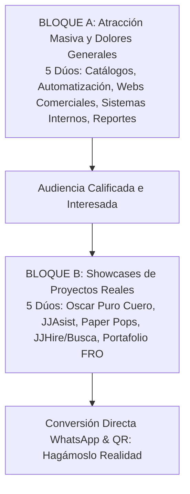

# 🚀 Plan Maestro de Contenidos: 10 Posts & 10 Videos FRO (Estrategia Rebalanceada)
> **Documento de Referencia Estratégica y Producción de Marketing**  
> **Marca:** Felipe Roldán Ocampo (FRO)  
> **Estrategia Dual:** 5 Dúos de **Atracción General** (cazar público amplio atacando dolores universales de negocios) + 5 Dúos de **Spotlight de Proyectos Reales** (publicitar cada solución ya creada y funcionando como prueba social).  
> **Flujo de Ejecución:** Producción iterativa par por par (1 Post en HTML &rarr; Imagen + 1 Video Vertical 9:16).

---

## 🎯 1. Arquitectura de la Estrategia (Embudo de Contenido)

Para que el marketing no dependa únicamente de un producto específico, dividimos los 10 contenidos en dos bloques complementarios:

1. **Bloque A (Generalistas / Top of Funnel - Dúos 1 al 5):**
   * *Objetivo:* Cazar más público. Que cualquier dueño de comercio, pyme, profesional o empresa se sienta identificado de inmediato con un dolor cotidiano.
   * *Temas:* Ventas por WhatsApp desordenadas, pérdida de tiempo en planillas de Excel, sitios web obsoletos que espantan clientes, sistemas enlatados caros que no sirven.
2. **Bloque B (Específicos / Showcases de Proyectos Creados - Dúos 6 al 10):**
   * *Objetivo:* Demostrar autoridad y tracción real. Publicitar cada desarrollo terminado mostrando cómo funciona en la vida real.
   * *Temas:* Oscar Puro Cuero, JJAsist, Paper Pops, JJHire & JJBusca, y el Portafolio Global FRO.

---

## 🎨 2. Sistema de Diseño y Branding Unificado

### Paleta Oficial FRO
* **Canvas Oscuro (Fondo Principal):** `#16232A` (Mirage) con trama de cuadrícula técnica en opacidad 8%.
* **Canvas Claro (Fondos de Video & Alternativas):** `#F5F5F7` / `#E4EEF0` para contraste con mockups oscuros.
* **Acento Primario (CTA & Resaltados):** `#FF5B04` (Blaze Orange) — *Hover:* `#D94A00`.
* **Contenedores & Bordes Tecnológicos:** `#075056` (Deep Sea) y `rgba(7, 80, 86, 0.5)`.
* **Tipografía Display:** `Barlow Condensed` (pesos 700 y 900 Ultra-Black en mayúsculas, tracking negativo). En video también `Inter` (800/900).
* **Tipografía de Lectura:** `Barlow` (400 Regular y 500 Medium).
* **Chips & Badges Técnicos:** `JetBrains Mono` (mayúsculas, tracking amplio).

### Reglas Obligatorias de Marca
* **PROHIBICIÓN ESTRICTA:** NUNCA mencionar *Biometría* ni *Reconocimiento Facial*. En JJAsist el fichaje es 100% **GPS y Código QR Dinámico**.
* **Cierre de Conversión:** Siempre remitir a WhatsApp (+54 9 3329 52-3459) y Código QR directo con el claim *"Hagámoslo Realidad"*.
* **Isotipo:** Isotipo FRO 3D Isométrico (`LOGO_3.png` / `LOGO_1.png`) con resplandor naranja sutil.

---

## 🛠️ 3. Formato y Flujo Técnico de Producción

* **Posts Gráficos (HTML &rarr; PNG):**
  * Tamaño: **1080 x 1350 px** (4:5 vertical, formato de máximo impacto en feed de Instagram y LinkedIn).
  * Construidos con HTML + Tailwind/CSS inline, usando mockups reales de dispositivos y tipografías cargadas por CDN.
  * Renderizados a imagen PNG nítida a 2x escala mediante script automatizado con Puppeteer.
* **Videos Verticales (9:16):**
  * Tamaño: **1080 x 1920 px** (Reels, TikTok, Shorts, Estados).
  * Duración: **15 a 25 segundos** (cortos, dinámicos, orientados al grano).
  * Estructura: Hook de dolor (0-3s) &rarr; Solución en movimiento en mockup (3-15s) &rarr; Beneficio directo (15-20s) &rarr; Outro oficial FRO con CTA (20-25s).

---

## 📋 4. Los 10 Dúos Estratégicos (Post + Video)

---

### 🌐 BLOQUE A: ATRACCIÓN GENERAL (CAZAR PÚBLICO AMPLIO)

#### 📦 DÚO 1: Catálogos Web & Tiendas Online para Negocios
* **Concepto General:** ¿Tu negocio sigue vendiendo por WhatsApp pasando fotos sueltas o PDFs pesados?
* **Dolor Universal:** Clientes que no quieren descargar un archivo de 30MB ni esperar horas a que les pasen un precio. Pérdida de ventas por fricción.
* **Solución General:** Catálogo web ultrarrápido y visual que abre al instante en el celular, con buscador, filtros y botón para enviar el pedido armado directo al WhatsApp del negocio.
* **Post HTML (1080x1350):** Titular masivo *"Dejá de mandar PDFs que nadie abre. Creá un catálogo web que venda 24/7."* + Mockup de celular interactivo con productos y botón *"Hacer Pedido"*.
* **Video 9:16 (18s):** PDF cargando lento tachado con cruz roja &rarr; Apertura instantánea de catálogo en smartphone &rarr; Selección de producto &rarr; Notificación de pedido listo.

#### 📊 DÚO 2: "Chau Planillas de Excel" (Digitalización de Procesos)
* **Concepto General:** Si hacés la misma tarea manual todos los días en una planilla, estás perdiendo plata y tiempo.
* **Dolor Universal:** Errores de carga manual, versiones duplicadas de archivos, datos que se pierden y horas invertidas en tareas mecánicas.
* **Solución General:** Sistemas web internos simples que centralizan la información, validan datos en tiempo real y eliminan las tareas repetitivas.
* **Post HTML (1080x1350):** Badge en JetBrains Mono `PROCESOS_MANUALES: OBSOLETOS`. Titular *"¿Cuántas horas por semana pierde tu equipo en Excel?"* + Tarjeta comparativa (Antes vs. Con Software a Medida).
* **Video 9:16 (20s):** Visual de planilla saturada de fórmulas &rarr; Transformación a panel web limpio con botones claros y confirmaciones en verde.

#### 🚀 DÚO 3: Tu Web como Vendedor 24/7 (Presencia Comercial de Alto Impacto)
* **Concepto General:** Tener una web no es tener un folleto digital, es tener un vendedor activo todos los días.
* **Dolor Universal:** Negocios sin página web o con sitios viejos y lentos que generan desconfianza frente a competidores modernos.
* **Solución General:** Sitios web diseñados con estética de alta gama, carga en menos de 1 segundo, optimizados para SEO y pensados para captar consultas comerciales.
* **Post HTML (1080x1350):** *"Tu cliente te busca en Google. ¿Qué encuentra?"* + Captura de laptop y celular mostrando una web comercial impecable y rápida.
* **Video 9:16 (18s):** Búsqueda en Google de un servicio &rarr; Aparición de sitio web moderno cargando al instante con botón directo de contacto.

#### ⚙️ DÚO 4: Software a Medida vs. Software "Enlatado"
* **Concepto General:** Por qué pagar licencias mensuales carísimas por programas genéricos que solo usás al 10%.
* **Dolor Universal:** Empresas que contratan plataformas gigantescas que no se adaptan a cómo trabajan realmente y complican a los empleados.
* **Solución General:** Desarrollar exactamente lo que tu operación necesita: ni más ni menos, simple de usar y 100% tuyo.
* **Post HTML (1080x1350):** Gráfico comparativo de alto contraste: *Software Enlatado (complejo, costoso, rígido)* vs. *Software a Medida FRO (rápido, simple, adaptado a tu flujo)*.
* **Video 9:16 (20s):** Pantalla saturada de menús innecesarios que se limpian para dejar un panel a medida intuitivo de 3 botones principales.

#### ⚡ DÚO 5: Automatización de Reportes & Sincronización de Datos
* **Concepto General:** Reportes semanales y mensuales listos en 1 segundo sin tocar un solo botón.
* **Dolor Universal:** Pasar los viernes a la tarde compilando métricas de distintas fuentes para enviarlas a jefes o clientes.
* **Solución General:** Automatizaciones que recopilan los datos automáticamente, generan el reporte en PDF o Google Sheets y lo envían por email o Telegram solo.
* **Post HTML (1080x1350):** Badge `AUTOMATIZACIÓN_ACTIVA`. Titular *"El reporte que te tomaba 3 horas, ahora se genera solo los lunes a las 8:00 AM."*
* **Video 9:16 (18s):** Reloj avanzando rápido &rarr; Notificación emergente: *"Reporte Semanal Generado y Enviado"* con vista previa del PDF impecable.

---

### 🏆 BLOQUE B: SPOTLIGHT DE PROYECTOS ESPECÍFICOS (PUBLICITAR LO CREADO)

#### 👞 DÚO 6: Spotlight "Oscar — Puro Cuero" (E-Commerce + Generador de Marketing)
* **Proyecto:** Oscar Puro Cuero (`oscarpurocuero-delta.vercel.app`).
* **Enfoque de Publicidad:** Cómo una marca tradicional de marroquinería artesanal escaló sus ventas con una tienda online premium y un panel que crea sus flyers y copies para redes automáticamente.
* **Post HTML (1080x1350):** Showcase visual con foto del producto de cuero + mockup de la tienda + badge del generador de contenido integrado.
* **Video 9:16 (22s):** Recorrido por el catálogo de Oscar &rarr; Clic en el panel de administración &rarr; Generación automática de pieza para redes sociales.

#### 📍 DÚO 7: Spotlight "JJAsist" (Control de Asistencia con GPS y QR Dinámico)
* **Proyecto:** JJAsist (`jj-asist.vercel.app`).
* **Enfoque de Publicidad:** El sistema definitivo para saber en tiempo real quién entró a trabajar, dónde y a qué hora, sin planillas falsificables ni hardware costoso.
* **Post HTML (1080x1350):** Celular con escaneo de QR y confirmación de geolocalización GPS verde + captura de sincronización instantánea en planilla de Google Sheets.
* **Video 9:16 (22s):** Empleado escaneando QR dinámico en pantalla &rarr; Cartel *"Fichaje Exitoso en Sucursal Norte (GPS Validado)"* &rarr; Fila apareciendo al instante en la central de monitoreo.

#### 🍭 DÚO 8: Spotlight "Paper Pops" (Tienda Digital Interactiva)
* **Proyecto:** Paper Pops (`paperpops.vercel.app`).
* **Enfoque de Publicidad:** Una tienda digital visualmente impactante, diseñada para que navegar productos y comprar sea tan fácil y entretenido como deslizar en TikTok.
* **Post HTML (1080x1350):** Mockup de smartphone centrado mostrando la interfaz fresca de Paper Pops con microanimaciones y botones de compra directos.
* **Video 9:16 (20s):** Scroll fluido por el catálogo de Paper Pops mostrando la velocidad de navegación y el carrito dinámico adaptado a celulares.

#### 👔 DÚO 9: Spotlight "JJHire & JJBusca" (Plataforma Integral de Reclutamiento)
* **Proyecto:** JJHire & JJBusca (`jj-hire.vercel.app` / `jj-busca.vercel.app`).
* **Enfoque de Publicidad:** Ecosistema doble para consultoras de RRHH: portal público donde los candidatos cargan su CV y panel privado para que los selectores filtren perfiles en segundos.
* **Post HTML (1080x1350):** Pantalla dividida: a la izquierda la postulación simple del candidato y a la derecha el panel de control del selector con estadísticas de búsqueda laboral.
* **Video 9:16 (22s):** Postulante enviando su currículum desde el celular &rarr; Alerta instantánea en el panel de JJHire con el perfil clasificado y listo para entrevista.

#### 🚀 DÚO 10: Spotlight Portafolio Personal FRO ("De la Idea a Producción")
* **Proyecto:** Portafolio Oficial FRO (`portafolio-felipe.vercel.app`).
* **Enfoque de Publicidad:** El resumen de todos los proyectos construidos, stack tecnológico de vanguardia y propuesta para construir la solución digital que cualquier negocio necesita hoy.
* **Post HTML (1080x1350):** Composición visual de múltiples dispositivos (laptop + tablet + celular) rodeados por el isotipo FRO 3D y el claim *"Hagámoslo Realidad"*.
* **Video 9:16 (25s):** Transición ultra-dinámica recapitulando los proyectos (Oscar, JJAsist, PaperPops, JJHire) y remate con invitación directa a cotizar por WhatsApp.

---

## 🎬 Plan de Ejecución Inmediata (Empezamos con DÚO 1)

1. **Paso 1:** Desarrollar el archivo HTML del **Post 1 (Catálogos Web & Tiendas Online)** en formato 1080x1350.
2. **Paso 2:** Renderizar el HTML a imagen PNG en alta definición.
3. **Paso 3:** Desarrollar el guion y el archivo de animación para el **Video Vertical 1 (9:16)**.
4. **Paso 4:** Una vez aprobado el Dúo 1, pasar al Dúo 2, y así sucesivamente.
